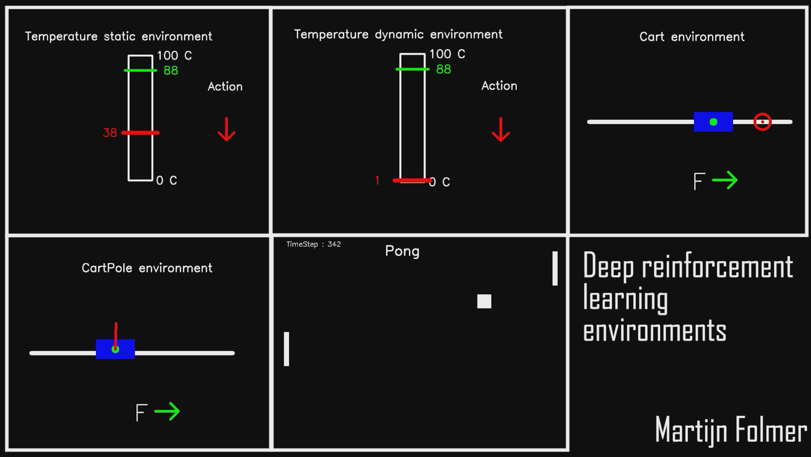

# DeepReinforcementEnvironments

A collection of environments that can be used to practice control methods on, such as deep q-learning. This project was based on a desire to learn about deep q-learning methods using the openAI gym environment. However, getting the openAI gym environment to run on windows is quite hard (it is supported on macOS and linux). So I made a couple of my own environments in python and applied deep learning methods to them.

Deep q-learning is a reinforcement learning technique that utilizes a neural network instead of a more basic q-table. Each environment is contained within a single python file (in the environments folder), each of which ahs a corresponding, sepparate python file with my attempt to train an agent on each of these environments to perform their tasks. 

Please feel free to use these environments in any way. I used them for deep-q learning, but they can also be used to practice with other control methods.

## The Environments:
The environments as seen in the image from top left to bottom right are described as follows:

-__Env_Temperature_static__: The goal for this environment is to reach a given temperature (38 C). The environment starts with a random temperature between 0 and 100 degrees celcius and can be raised or decreased by 1 degree every timestep. This is the most simple of the environments.

-__Env_Temperature_dynamic__:  The goal for this environment is to reach a given temperature  (randomly chosen at start between 0 and 100). The environment current goal starts with a random temperature between 0 and 100 degrees celcius and can be raised or decreased by 1 degree every timestep. It is the same as the Env_Temperature_static environment, except for not knowing beforehand what the goal temperature will be.

-__Env_Cart__: This environment consists of a cart on a line, with a goal of moving to another point on that line. The cart can be influenced by either applying a positive force on it, or a negative force on it. Applying no force is not an option. The cart always starts out in the center.

-__Env_Cartpole__: This environment consists of a cart on a line, with a inverted pendulum pointing upwards. The goal is to keep this pendulum upright by applying forces to the cart. You can either apply a force to the left or a force to the right. Applying no force is not an option. The cart always starts in the center, with a small random perturbation given to the cart and the pendulum.

-__Env_Pong__: This environment is based on the classic Pong game. In it, you will be controlling both paddles (on the left and one the right) which can both move up, move down, or remain where they are, resulting in 9 different combinations of actions that can be taken. The goal is to last as long as possible, as the ball keeps speeding up with each paddle hit.

## The standard functions

Each environment has at least the following functions:
- __step(self, action)__ : Performs a single timestep in the environment, given an action. Will update the state within the environment and returns this new state and the reward for reaching this state
- __calculateNextState(self, state, action)__ : Calculates the next state, given a current state and the action we wish to perform. Does not in itself update any values within the class.
- __calculateReward(self, state)__ : Calculates what the reward is for reaching the current state. Rewards are used to improve our deep q learning and train our neural network
- __render(self, state, action)__ : returns an image of our environment, used for visualising how the simulation is doing and creating videos
- __reset(self)__ : resets the environment to an original state and resets all variables needed to run the next simulation

If you want to create your own environment to work with one of the deep-q learning python scripts, you will need at least these functions in order to be compatible.
     
